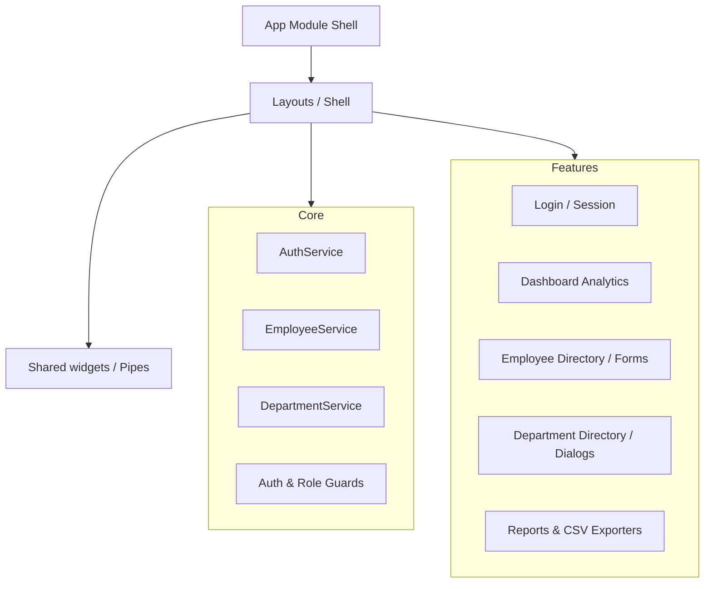

# Enterprise Employee Management System (EMS)

[](https://angular.io/)
[](LICENSE)
[](https://sass-lang.com/)
[](https://github.com/typicode/json-server)

A production-ready, high-fidelity Enterprise Employee Management System built using **Angular 20** standalone architecture, **Angular Signals** for reactive state control, **Angular Material** design systems, and mock REST backend services.

---

## 🏗️ Architecture Overview

The application follows a modular, scalable **Feature-Based Architecture**. Core utilities, shared widgets, and isolated layouts are structured separately from features.



---

## 🛠️ Tech Stack

*   **Framework:** Angular 20 (Standalone Components architecture)
*   **State Management:** Angular Signals & RxJS Observables
*   **Styles:** Vanilla SCSS (Responsive custom grid flows)
*   **Design System:** Angular Material Design (M3)
*   **Forms:** Reactive Forms (Nested FormGroups with validators)
*   **Router:** Angular Router with lazy loading & functional route guards
*   **Database Mocking:** JSON Server REST APIs
*   **Linters & Formatters:** ESLint & Prettier code validation

---

## 📂 Project Structure

```text
src/
├── app/
│   ├── core/                  # Core modules (singleton service providers)
│   │   ├── constants/         # App constants (API, URLs)
│   │   ├── guards/            # Functional Route & Role Guards
│   │   ├── interceptors/      # Loading bar & Error Interceptors
│   │   ├── models/            # Core models (Employee, Department, User)
│   │   └── services/          # Services (Auth, Employee, Department, Notification, Loading)
│   ├── layout/                # Main shells (AdminLayoutComponent)
│   ├── features/              # Feature modules (Lazy-loaded modules)
│   │   ├── dashboard/         # Dashboard KPI cards & SVG charts
│   │   ├── departments/       # Department CRUD list & dialog forms
│   │   ├── employees/         # Employee CRUD directory & profile details
│   │   ├── login/             # Login forms
│   │   ├── reports/           # Reports graphs, date filters & CSV exporters
│   │   └── not-found/         # 404 views
│   └── shared/                # Shared utilities
│       ├── components/        # Reusable components (Confirm Dialog)
│       └── pipes/             # Reusable formatters (PhoneFormat)
└── assets/                    # Static image files and styles
```

---

## 🌟 Key Features

1.  **Role-Based Access Control (RBAC):**
    *   Protected routing with expected roles limits views dynamically:
        *   **Admin:** Complete access (Dashboard, Employees, Departments, Reports, Settings).
        *   **HR:** Employee directory, addition/editing, and department configurations.
        *   **Manager:** Dashboard review, employee rosters, and reports.
    *   Functional auth and role validation guards intercept unauthorized route access.
2.  **Live Analytics & SVG Charting:**
    *   Responsive dashboard displaying total counts and active ratios.
    *   No heavy graphing plugins needed: plots ratios using native, responsive **SVG Donut segment charts**, cumulative growth line drawings, and CSS columns.
3.  **Complete Employee & Department CRUD Directories:**
    *   Paginated material tables sorting and searching records.
    *   Nested form groups mapping residential address parameters.
    *   Confirmation warnings preventing deletes of departments with active staff allocations.
4.  **CSV Reports Engine:**
    *   Download customized reports using instant local Blob compilers mapping dates and departments.

---

## 🚀 Installation & Local Setup

### Prerequisites

Ensure you have [Node.js](https://nodejs.org/) installed (v18+ recommended).

### 1. Clone the Repository
```bash
git clone https://github.com/RahulJaggi/Enterprise-Employee-Management-System.git
cd Enterprise-Employee-Management-System
```

### 2. Install Dependencies
```bash
npm install --legacy-peer-deps
```

### 3. Run the Concurrent Dev Servers
Launch the mock JSON Server backend (running at `localhost:3000`) and the Angular development application server (running at `localhost:4200`) simultaneously:
```bash
npm start
```

---

## 📸 Screenshots Placeholders

| Login Panel | Dashboard Analytics |
|:---:|:---:|
| `[Screenshot Placeholder: Login Page]` | `[Screenshot Placeholder: Dashboard Page]` |

| Employee List | Reports & Analytics |
|:---:|:---:|
| `[Screenshot Placeholder: Employee Directory]` | `[Screenshot Placeholder: Reports CSV Export]` |

---

## 🔮 Future Improvements

*   **Multi-tenant Organization Setup:** Supporting multiple regional branch entities.
*   **PDF Paystub Generation:** Exporting employee salary slips directly.
*   **Dark Mode Toggle:** Native Material theme swapper in the Settings view.
*   **Audit logs:** Tracks records changes and log edits.

---

## 🤝 Contributing Guide

1.  Fork the Project.
2.  Create your Feature Branch (`git checkout -b feature/AmazingFeature`).
3.  Commit your Changes (`git commit -m 'feat: add amazing feature'`).
4.  Push to the Branch (`git push origin feature/AmazingFeature`).
5.  Open a Pull Request.

---

## 📄 License

Distributed under the MIT License. See [LICENSE](LICENSE) for details.
