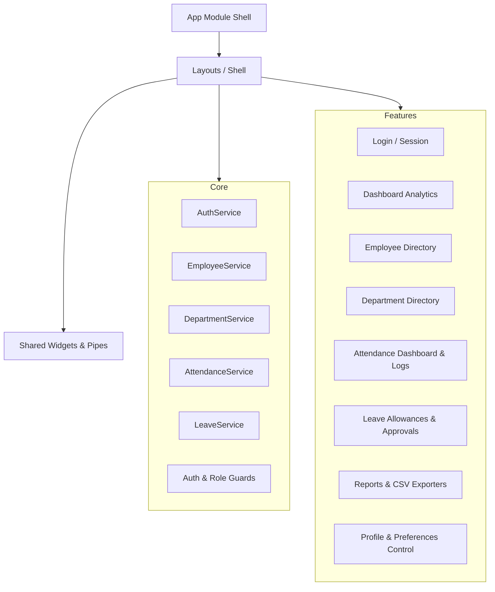

# Enterprise Employee Management System (EMS)

[](https://angular.io/)
[](LICENSE)
[](https://sass-lang.com/)
[](https://github.com/typicode/json-server)

A production-ready, high-fidelity Enterprise Employee Management System built using **Angular 20** standalone components, **Angular Signals** for reactive state management, **Angular Material** design systems, and mock REST backend services. 

The entire UI/UX has been redesigned from the ground up to reflect a premium SaaS admin dashboard inspired by the design systems of **Linear, Vercel, Stripe, and GitHub**.

---

## 🏗️ Architecture Overview

The application follows a modular, scalable **Feature-Based Architecture**. Core utilities, singleton services, and layout structures are clearly isolated from user features.



---

## 🛠️ Tech Stack

*   **Framework:** Angular 20 (Standalone Components architecture)
*   **State Management:** Angular Signals & RxJS Observables
*   **Styles:** Vanilla SCSS (Design Tokens, responsive grids, dark/light theme overrides)
*   **Design System:** Angular Material Design (M3)
*   **Forms:** Reactive Forms (Nested FormGroups with validators)
*   **Router:** Angular Router with lazy loading & functional route guards
*   **Database Mocking:** JSON Server REST APIs
*   **Linters & Formatters:** ESLint & Prettier code validation

---

## 📂 Project Structure

```text
src/
├── app/
│   ├── core/                  # Core modules (singleton service providers)
│   │   ├── constants/         # App constants (API, URLs)
│   │   ├── guards/            # Functional Route & Role Guards
│   │   ├── interceptors/      # Loading bar & Error Interceptors
│   │   ├── models/            # Core models (Employee, Department, Attendance, Leave)
│   │   └── services/          # Services (Auth, Employee, Department, Attendance, Leave)
│   ├── layout/                # Main shells (AdminLayoutComponent)
│   ├── features/              # Feature modules (Lazy-loaded modules)
│   │   ├── dashboard/         # Overview KPI cards & SVG charts
│   │   ├── departments/       # Department CRUD list & dialog forms
│   │   ├── employees/         # Employee CRUD directory & profile details
│   │   ├── attendance/        # Attendance Dashboard, logs, & time fields
│   │   ├── leaves/            # Leave allowances balance, requests, & approvals
│   │   ├── settings/          # Tabbed preferences, profile forms, & dark/light theme toggler
│   │   ├── login/             # Login Forms & Demo credentials hints
│   │   ├── reports/           # Reports graphs, date filters & CSV exporters
│   │   └── not-found/         # 404 views
│   └── shared/                # Shared utilities
│       ├── components/        # Reusable components (Confirm Dialog)
│       └── pipes/             # Reusable formatters (PhoneFormat)
└── assets/                    # Static image files and global styles
```

---

## 🌟 Key Features

1.  **Premium SaaS UI/UX (Linear & Vercel Inspired):**
    *   Sleek collapsible left sidebar with clean navigation pills.
    *   Floating top toolbar with integrated simulated search console and notification alerts.
    *   High-contrast, responsive layouts using **Inter** variable typography.
    *   Native Dark/Light theme mode toggler with persistent state stored in `localStorage`.
2.  **Attendance & Time-Card Logger:**
    *   Attendance Dashboard tracking today's counts for Present, Absent, Late, and WFH stats.
    *   Full CRUD logs table with sorting, searching, date range filters, and department/employee dropdown selectors.
    *   Automatic working hours calculation based on check-in and check-out inputs.
3.  **Leave & Allowance Approvals:**
    *   Allowance balance grid cards displaying Casual, Sick, Earned, and WFH days remaining.
    *   Interactive leave application forms validating date ranges and durations.
    *   Managers and Admins can view leave details and choose to **Approve** or **Reject** leaves with custom comments.
4.  **Role-Based Access Control (RBAC):**
    *   Protected routing dynamically restricting layouts based on roles:
        *   **Admin:** Complete access (Dashboard, Employees, Departments, Attendance, Leaves, Reports, Settings).
        *   **HR:** Dashboard, Employees, Departments, Attendance, and Leaves.
        *   **Manager:** Dashboard, Employees, Attendance, Leaves, and Reports.
    *   Functional auth and role validation guards intercept unauthorized route access.
5.  **Live SVG Analytics:**
    *   Visual distribution donut segment charts and line area curves plotted using native, responsive **SVG markup** instead of heavy graph libraries.
6.  **CSV Export Engine:**
    *   Export customized report queries instantly using local Blob compiler engines.

---

## 🚀 Installation & Local Setup

### Prerequisites

Ensure you have Node.js installed (v18+ recommended).

### 1. Clone the Repository
```bash
git clone https://github.com/RahulJaggi/Enterprise-Employee-Management-System.git
cd Enterprise-Employee-Management-System
```

### 2. Install Dependencies
```bash
npm install --legacy-peer-deps
```

### 3. Run the Concurrent Dev Servers
Launch the mock JSON Server backend (running at `localhost:3000`) and the Angular development application server (running at `localhost:4200`) simultaneously:
```bash
npm start
```

---

## 📸 Screenshots Placeholders

| Login Panel | Dashboard Analytics |
|:---:|:---:|
| `[Screenshot Placeholder: Login Page]` | `[Screenshot Placeholder: Dashboard Page]` |

| Employee List | Reports & Analytics |
|:---:|:---:|
| `[Screenshot Placeholder: Employee Directory]` | `[Screenshot Placeholder: Reports CSV Export]` |

---

## 🔮 Future Improvements

*   **Multi-tenant Organization Setup:** Supporting multiple regional branch entities.
*   **PDF Paystub Generation:** Exporting employee salary slips directly.
*   **Audit Logging:** Database tracking logs capturing record modifications and credential changes.

---

## 🤝 Contributing Guide

1.  Fork the Project.
2.  Create your Feature Branch (`git checkout -b feature/AmazingFeature`).
3.  Commit your Changes (`git commit -m 'feat: add amazing feature'`).
4.  Push to the Branch (`git push origin feature/AmazingFeature`).
5.  Open a Pull Request.

---

## 📄 License

Distributed under the MIT License. See [LICENSE](LICENSE) for details.
